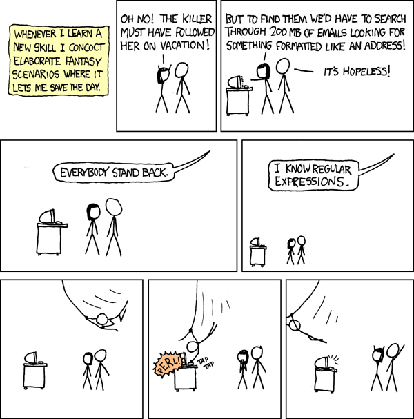
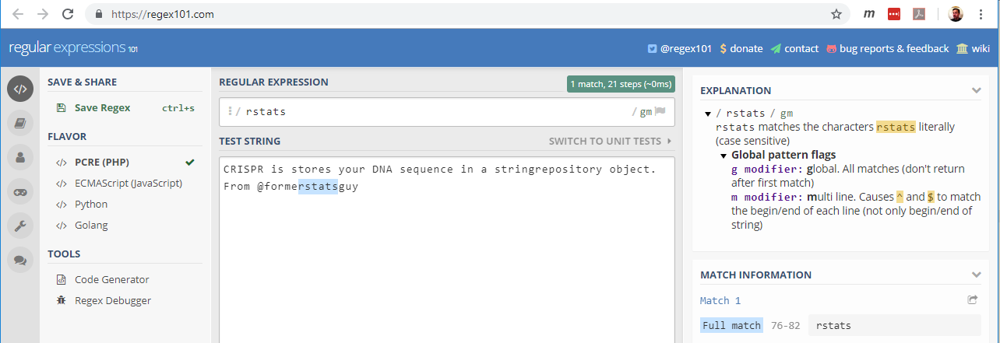
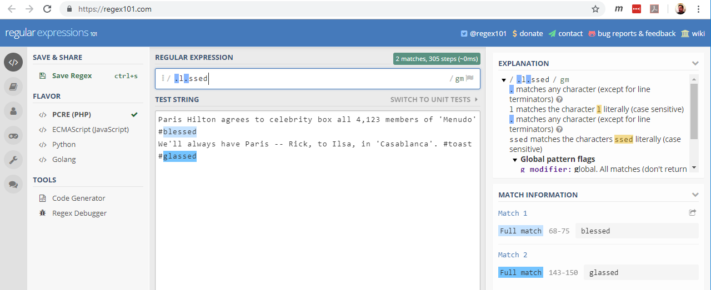

`stringr` Package for String Manipulation in R
========================================================
author: Matthew Pettis (matthew.pettis@gmail.com)
date: 2019-01-17
autosize: true

<style>
.small-code pre code {
  font-size: 1em;
}
</style>


Motivation
========================================================



... And a Warning
========================================================
> Some people, when confronted with a problem, think "I know, I'll use regular expressions." Now they have two problems. -- Jamie Zawinski (attributed)


What Problems Do You Attack with Regular Expressions / `stringr`?
========================================================
class:small-code
### Detecting strings and string patterns


```r
library(stringr)
tweet_strings <- c(
      "The stringr packages has a new version! Easy as 123! #rstats"
      
    , "Paris Hilton agrees to celebrity box all 4,123 members of 'Menudo' #blessed"
    
    , "CRISPR is stores 21 of 23 chromosomal DNA sequence in a stringrepository object. From @formerstatsguy"
    
    , "We'll always have Paris -- Rick, to Ilsa, in 'Casablanca'. #toast #glassed"
    
    , "Feel-good music throwback: '1-2-3-4', Feist"
)
```


========================================================
class:small-code
### Detecting strings and string patterns

Which elements contain the string 'rstats'?

```r
str_detect(tweet_strings, "rstats")
```

```
[1]  TRUE FALSE  TRUE FALSE FALSE
```

Often, we just want the actual strings that had matches


```r
str_subset(tweet_strings, "rstats")
```

```
[1] "The stringr packages has a new version! Easy as 123! #rstats"                                         
[2] "CRISPR is stores 21 of 23 chromosomal DNA sequence in a stringrepository object. From @formerstatsguy"
```
***
```
"The stringr packages has a new version! Easy as 123! #rstats"

"Paris Hilton agrees to celebrity box all 4,123 members of 'Menudo' #blessed"

"CRISPR is stores 21 of 23 chromosomal DNA sequence in a stringrepository object. From @formerstatsguy"

"We'll always have Paris -- Rick, to Ilsa, in 'Casablanca'. #toast #glassed"

"Feel-good music throwback: '1-2-3-4', Feist"
```


========================================================
### Detecting strings and string patterns

Why did it match the second line?  You can throw it in an online parser that helps you figure out what is going on:



========================================================
class:small-code
### Detecting strings and string patterns

Some times the strings aren't fixed, and you want a pattern that has some fill you don't care about.

```r
str_subset(tweet_strings, ".l.ssed")
```

```
[1] "Paris Hilton agrees to celebrity box all 4,123 members of 'Menudo' #blessed"
[2] "We'll always have Paris -- Rick, to Ilsa, in 'Casablanca'. #toast #glassed" 
```
***
```
"The stringr packages has a new version! Easy as 123! #rstats"

"Paris Hilton agrees to celebrity box all 4,123 members of 'Menudo' #blessed"

"CRISPR is stores 21 of 23 chromosomal DNA sequence in a stringrepository object. From @formerstatsguy"

"We'll always have Paris -- Rick, to Ilsa, in 'Casablanca'. #toast #glassed"

"Feel-good music throwback: '1-2-3-4', Feist"
```


========================================================
### Detecting strings and string patterns

What were the matches?



========================================================
class:small-code
### Capturing strings

Once we have match, with patterns, often we want to record what the pattern matched.  Let's look at capturing numbers


```r
str_extract(tweet_strings, "\\d+")
```

```
[1] "123" "4"   "21"  NA    "1"  
```
***
```
"The stringr packages has a new version! Easy as 123! #rstats"

"Paris Hilton agrees to celebrity box all 4,123 members of 'Menudo' #blessed"

"CRISPR is stores 21 of 23 chromosomal DNA sequence in a stringrepository object. From @formerstatsguy"

"We'll always have Paris -- Rick, to Ilsa, in 'Casablanca'. #toast #glassed"

"Feel-good music throwback: '1-2-3-4', Feist"
```


========================================================
class:small-code
### Capturing strings

Note we didn't capture all of the numbers.  How can we do that?


```r
str_extract_all(tweet_strings, "\\d+")
```

```
[[1]]
[1] "123"

[[2]]
[1] "4"   "123"

[[3]]
[1] "21" "23"

[[4]]
character(0)

[[5]]
[1] "1" "2" "3" "4"
```
***
```
"The stringr packages has a new version! Easy as 123! #rstats"

"Paris Hilton agrees to celebrity box all 4,123 members of 'Menudo' #blessed"

"CRISPR is stores 21 of 23 chromosomal DNA sequence in a stringrepository object. From @formerstatsguy"

"We'll always have Paris -- Rick, to Ilsa, in 'Casablanca'. #toast #glassed"

"Feel-good music throwback: '1-2-3-4', Feist"
```


========================================================
class:small-code
### Capturing strings

Once we have match, with patterns, often we want to record what the pattern matched.  Let's look at capturing numbers


```r
str_match(tweet_strings, "(\\d+)")
```

```
     [,1]  [,2] 
[1,] "123" "123"
[2,] "4"   "4"  
[3,] "21"  "21" 
[4,] NA    NA   
[5,] "1"   "1"  
```
***
```
"The stringr packages has a new version! Easy as 123! #rstats"

"Paris Hilton agrees to celebrity box all 4,123 members of 'Menudo' #blessed"

"CRISPR is stores 21 of 23 chromosomal DNA sequence in a stringrepository object. From @formerstatsguy"

"We'll always have Paris -- Rick, to Ilsa, in 'Casablanca'. #toast #glassed"

"Feel-good music throwback: '1-2-3-4', Feist"
```


========================================================
class:small-code
### Capturing strings

Once we have match, with patterns, often we want to record what the pattern matched.  Let's look at capturing numbers


```r
str_match(tweet_strings, "(\\d+)")
```

```
     [,1]  [,2] 
[1,] "123" "123"
[2,] "4"   "4"  
[3,] "21"  "21" 
[4,] NA    NA   
[5,] "1"   "1"  
```
***
+ This returns a matrix.  Each row corresponds to an input.  Column 1 is the whole match, column 2 are the individual groupings that got matched.


```r
str_match("612-555-1212", "(\\d+).(\\d+).(\\d+)")
```

```
     [,1]           [,2]  [,3]  [,4]  
[1,] "612-555-1212" "612" "555" "1212"
```


========================================================
class:small-code

### Capturing all strings
Sometimes we need patterns to be able to handle arbitrary characters we don't care about:


```r
str_match_all(tweet_strings, "(\\d+(?:.\\d+)*)")
```

```
[[1]]
     [,1]  [,2] 
[1,] "123" "123"

[[2]]
     [,1]    [,2]   
[1,] "4,123" "4,123"

[[3]]
     [,1] [,2]
[1,] "21" "21"
[2,] "23" "23"

[[4]]
     [,1] [,2]

[[5]]
     [,1]      [,2]     
[1,] "1-2-3-4" "1-2-3-4"
```
***
```
"The stringr packages has a new version! Easy as 123! #rstats"

"Paris Hilton agrees to celebrity box all 4,123 members of 'Menudo' #blessed"

"CRISPR is stores 21 of 23 chromosomal DNA sequence in a stringrepository object. From @formerstatsguy"

"We'll always have Paris -- Rick, to Ilsa, in 'Casablanca'. #toast #glassed"

"Feel-good music throwback: '1-2-3-4', Feist"
```


========================================================
class:small-code
# Dataframe example
Here I use `str_match()` rather than `str_extract()` because I use `<>` to
identify where to do the capture, but I don't want those characters in the
captured text itself.

```r
library(tidyverse)
df <- tribble(
  ~input_text,
  "I want <this stuff>",
  "<and some> of this",
  "It may <be in the> middle"
)
df %>%
  mutate(capture = str_match(input_text, "<(.*?)>") %>% .[,2])
```

```
# A tibble: 3 x 2
  input_text                capture   
  <chr>                     <chr>     
1 I want <this stuff>       this stuff
2 <and some> of this        and some  
3 It may <be in the> middle be in the 
```


========================================================
class:small-code
```
- This presentation: https://github.com/mpettis/stringr_2019-01
- `stringr` Documentation: https://stringr.tidyverse.org/index.html
- Regular expression resources:
    - Definitive, original book: https://www.amazon.com/Mastering-Regular-Expressions-Jeffrey-Friedl/dp/0596528124
    - A free, online book: https://www.gastonsanchez.com/Handling_and_Processing_Strings_in_R.pdf
    - Online, interactive tools to explain/debug regular expressions:
        - https://regexone.com/ (20 interactive lessons)
        - https://regex101.com/ (explains your patterns)
        - https://regexr.com/
        - https://www.regextester.com/
- Previous presentations:
    - Nick Salikowski: https://github.com/NickSalkowski/Regular-Expressions-with-R
```


Questions, and Thank You
========================================================
Matt Pettis
- email: matthew.pettis@gmail.com
- github: mpettis
- twitter: @mtpettis
